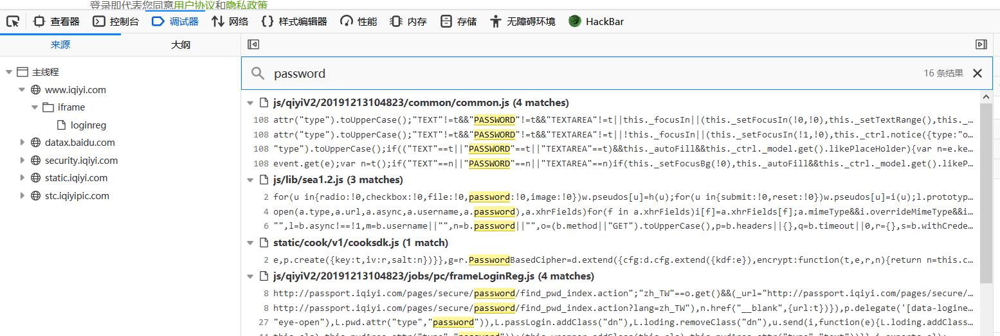
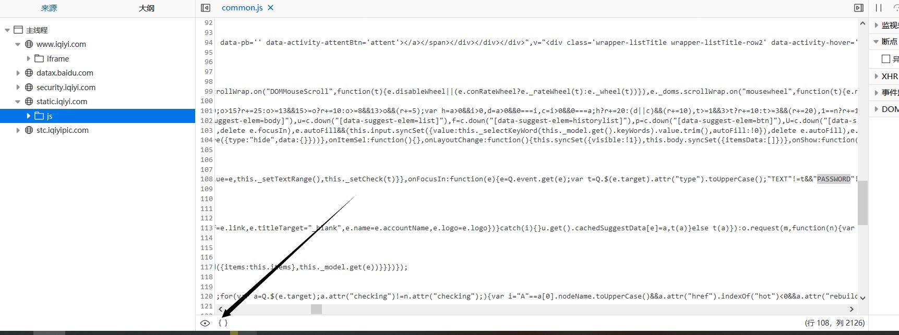
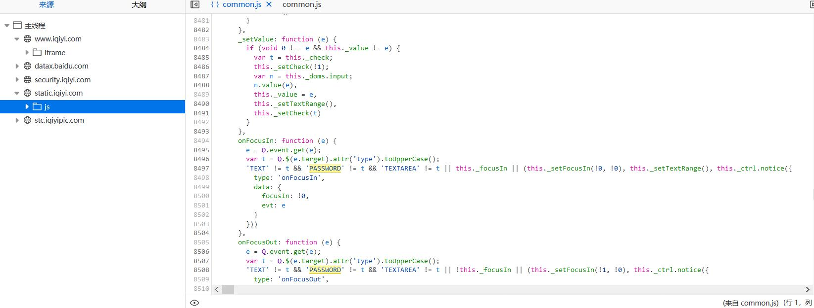
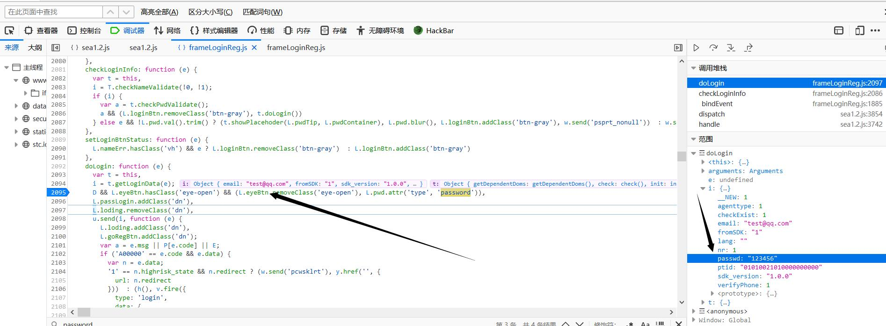
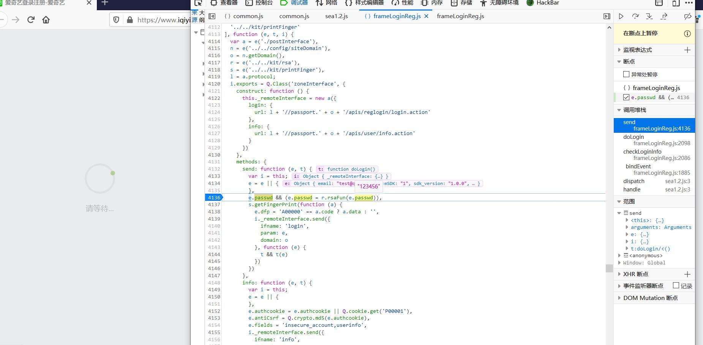
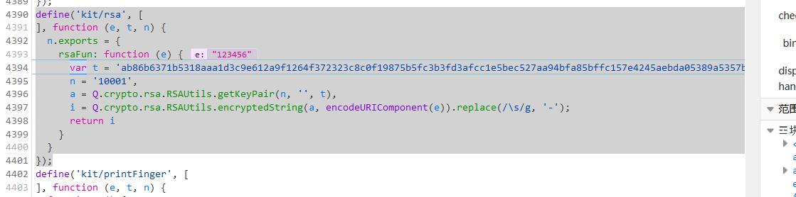
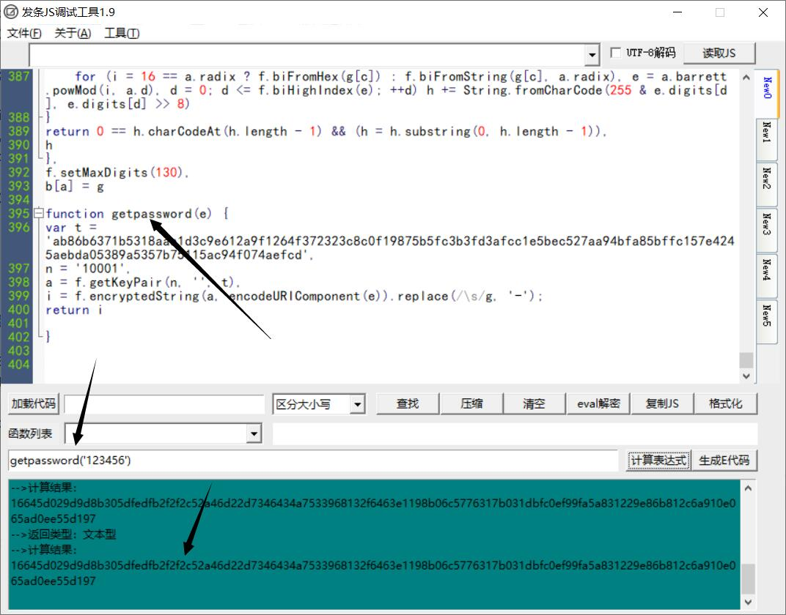

来到爱奇艺登录页面，输入账号和密码，使用bp进行抓包，我们可以看到数据包的构造是怎样的。**在password参数那里有一大串加密的字符串，现在我就要去解密**

```
POST /apis/reglogin/login.action HTTP/1.1
Host: passport.iqiyi.com
User-Agent: Mozilla/5.0 (Windows NT 10.0; Win64; x64; rv:72.0) Gecko/20100101 Firefox/72.0
Accept: application/json, text/javascript, */*; q=0.01
Accept-Language: zh-CN,zh;q=0.8,zh-TW;q=0.7,zh-HK;q=0.5,en-US;q=0.3,en;q=0.2
Content-Type: application/x-www-form-urlencoded; charset=UTF-8
Content-Length: 338
Origin: https://www.iqiyi.com
Connection: close
Referer: https://www.iqiyi.com/
Cookie: QC005=baee85c369036211d666ebba9d45a976; QC173=0; QC007=https%253A%252F%252Fwww.baidu.com%252Fs%253Fie%253Dutf-8%2526f%253D8%2526rsv_bp%253D1%2526rsv_idx%253D1%2526ch%253D%2526tn%253Dbaidu%2526bar%253D%2526wd%253Daiqiyi%2526rn%253D%2526oq%253D%2526rsv_pq%253Dea7ae4e10002e28a%2526rsv_t%253D9493FAlAQUQJjsU7%25252FOA5JMfNquPuhslJaC2lrDS0KWobyPsW%25252FHPUOgJQcVE%2526rqlang%253Dcn; QC006=vuuycjwmzysretls7yerxq9j; QC008=1579065221.1579065221.1579065221.1; QC010=66662058; nu=0; QYABEX={"pcw_home_movie":{"value":"new","abtest":"146_B"}}; QC175=%7B%22upd%22%3Atrue%2C%22ct%22%3A%22%22%7D; T00404=2e68cb1405786428aa565e7de2809f59; IMS=IggQABj_7fzwBSokCiAyZjZiMWM5OTJiMDZkZjJhNWQ1OThkYTRjYWNkODMzZhAA; Hm_lvt_53b7374a63c37483e5dd97d78d9bb36e=1579065255; Hm_lpvt_53b7374a63c37483e5dd97d78d9bb36e=1579065255; P00004=.1579065255.342d717979; QC160=%7B%22u%22%3A%22%22%2C%22lang%22%3A%22%22%2C%22local%22%3A%7B%22name%22%3A%22%E4%B8%AD%E5%9B%BD%E5%A4%A7%E9%99%86%22%2C%22init%22%3A%22Z%22%2C%22rcode%22%3A48%2C%22acode%22%3A86%7D%7D; __dfp=a08bf16afaabb84888bcc23cbdb19a18cb7cbe9dc529e532a9202d84028728f12a@1580361249752@1579065250752

email=test%40qq.com&fromSDK=1&sdk_version=1.0.0&passwd=16645d029d9d8b305dfedfb2f2f2c52a46d22d7346434a7533968132f6463e1198b06c5776317b031dbfc0ef99fa5a831229e86b812c6a910e065ad0ee55d197&agenttype=1&__NEW=1&checkExist=1&lang=&ptid=01010021010000000000&nr=1&verifyPhone=1&dfp=a08bf16afaabb84888bcc23cbdb19a18cb7cbe9dc529e532a9202d84028728f12a
```

使用火狐浏览器，进入调试器，ctrl+shift+F在所有文件中查找


查找关键字password，发现了16条结果，接下来就是要看那条结果符合我们的要求



随便点击一个结果，我们在左下角有个可以**格式化代码**的选项





找到了邮件参数，我们从右边可以看到密码的参数是**passwd**



接着，我们继续用passwd进行关键字搜索，找到了rsafunc函数

```
define('kit/rsa', [
], function (e, t, n) {
  n.exports = {
    rsaFun: function (e) {
      var t = 'ab86b6371b5318aaa1d3c9e612a9f1264f372323c8c0f19875b5fc3b3fd3afcc1e5bec527aa94bfa85bffc157e4245aebda05389a5357b75115ac94f074aefcd',
      n = '10001',
      a = Q.crypto.rsa.RSAUtils.getKeyPair(n, '', t),
      i = Q.crypto.rsa.RSAUtils.encryptedString(a, encodeURIComponent(e)).replace(/\s/g, '-');
      return i
    }
  }
});
```



F11步进就来到了rsafun函数，传进来的e参数是密码123456



对encry这个函数进行关键字查找，找到了这部分代码

```
var c = function (a, b) {
        function c(a) {
          var b = f,
          c = b.biDivideByRadixPower(a, this.k - 1),
          d = b.biMultiply(c, this.mu),
          e = b.biDivideByRadixPower(d, this.k + 1),
          g = b.biModuloByRadixPower(a, this.k + 1),
          h = b.biMultiply(e, this.modulus),
          i = b.biModuloByRadixPower(h, this.k + 1),
          j = b.biSubtract(g, i);
          j.isNeg && (j = b.biAdd(j, this.bkplus1));
          for (var k = b.biCompare(j, this.modulus) >= 0; k; ) j = b.biSubtract(j, this.modulus),
          k = b.biCompare(j, this.modulus) >= 0;
          return j
        }
        function d(a, b) {
          var c = f.biMultiply(a, b);
          return this.modulo(c)
        }
        function e(a, b) {
          var c = new t;
          c.digits[0] = 1;
          for (var d = a, e = b; ; ) {
            if (0 != (1 & e.digits[0]) && (c = this.multiplyMod(c, d)), e = f.biShiftRight(e, 1), 0 == e.digits[0] && 0 == f.biHighIndex(e)) break;
            d = this.multiplyMod(d, d)
          }
          return c
        }
        var f,
        g = {
        };
        'undefined' == typeof g.RSAUtils && (f = g.RSAUtils = {
        });
        var h,
        k,
        l,
        m,
        n = 16,
        o = n,
        p = 65536,
        q = p >>> 1,
        r = p * p,
        s = p - 1,
        t = g.BigInt = function (a) {
          this.digits = 'boolean' == typeof a && a === !0 ? null : k.slice(0),
          this.isNeg = !1
        };
        f.setMaxDigits = function (a) {
          h = a,
          k = new Array(h);
          for (var b = 0; b < k.length; b++) k[b] = 0;
          l = new t,
          m = new t,
          m.digits[0] = 1
        },
        f.setMaxDigits(20);
        var u = 15;
        f.biFromNumber = function (a) {
          var b = new t;
          b.isNeg = 0 > a,
          a = Math.abs(a);
          for (var c = 0; a > 0; ) b.digits[c++] = a & s,
          a = Math.floor(a / p);
          return b
        };
        var v = f.biFromNumber(1000000000000000);
        f.biFromDecimal = function (a) {
          for (var b, c = '-' == a.charAt(0), d = c ? 1 : 0; d < a.length && '0' == a.charAt(d); ) ++d;
          if (d == a.length) b = new t;
           else {
            var e = a.length - d,
            g = e % u;
            for (0 == g && (g = u), b = f.biFromNumber(Number(a.substr(d, g))), d += g; d < a.length; ) b = f.biAdd(f.biMultiply(b, v), f.biFromNumber(Number(a.substr(d, u)))),
            d += u;
            b.isNeg = c
          }
          return b
        },
        f.biCopy = function (a) {
          var b = new t(!0);
          return b.digits = a.digits.slice(0),
          b.isNeg = a.isNeg,
          b
        },
        f.reverseStr = function (a) {
          for (var b = '', c = a.length - 1; c > - 1; --c) b += a.charAt(c);
          return b
        };
        var w = [
          '0',
          '1',
          '2',
          '3',
          '4',
          '5',
          '6',
          '7',
          '8',
          '9',
          'a',
          'b',
          'c',
          'd',
          'e',
          'f',
          'g',
          'h',
          'i',
          'j',
          'k',
          'l',
          'm',
          'n',
          'o',
          'p',
          'q',
          'r',
          's',
          't',
          'u',
          'v',
          'w',
          'x',
          'y',
          'z'
        ];
        f.biToString = function (a, b) {
          var c = new t;
          c.digits[0] = b;
          for (var d = f.biDivideModulo(a, c), e = w[d[1].digits[0]]; 1 == f.biCompare(d[0], l); ) d = f.biDivideModulo(d[0], c),
          digit = d[1].digits[0],
          e += w[d[1].digits[0]];
          return (a.isNeg ? '-' : '') + f.reverseStr(e)
        },
        f.biToDecimal = function (a) {
          var b = new t;
          b.digits[0] = 10;
          for (var c = f.biDivideModulo(a, b), d = String(c[1].digits[0]); 1 == f.biCompare(c[0], l); ) c = f.biDivideModulo(c[0], b),
          d += String(c[1].digits[0]);
          return (a.isNeg ? '-' : '') + f.reverseStr(d)
        };
        var x = [
          '0',
          '1',
          '2',
          '3',
          '4',
          '5',
          '6',
          '7',
          '8',
          '9',
          'a',
          'b',
          'c',
          'd',
          'e',
          'f'
        ];
        f.digitToHex = function (a) {
          var b = 15,
          c = '';
          for (i = 0; 4 > i; ++i) c += x[a & b],
          a >>>= 4;
          return f.reverseStr(c)
        },
        f.biToHex = function (a) {
          var b = '';
          f.biHighIndex(a);
          for (var c = f.biHighIndex(a); c > - 1; --c) b += f.digitToHex(a.digits[c]);
          return b
        },
        f.charToHex = function (a) {
          var b,
          c = 48,
          d = c + 9,
          e = 97,
          f = e + 25,
          g = 65,
          h = 90;
          return b = a >= c && d >= a ? a - c : a >= g && h >= a ? 10 + a - g : a >= e && f >= a ? 10 + a - e : 0
        },
        f.hexToDigit = function (a) {
          for (var b = 0, c = Math.min(a.length, 4), d = 0; c > d; ++d) b <<= 4,
          b |= f.charToHex(a.charCodeAt(d));
          return b
        },
        f.biFromHex = function (a) {
          for (var b = new t, c = a.length, d = c, e = 0; d > 0; d -= 4, ++e) b.digits[e] = f.hexToDigit(a.substr(Math.max(d - 4, 0), Math.min(d, 4)));
          return b
        },
        f.biFromString = function (a, b) {
          var c = '-' == a.charAt(0),
          d = c ? 1 : 0,
          e = new t,
          g = new t;
          g.digits[0] = 1;
          for (var h = a.length - 1; h >= d; h--) {
            var i = a.charCodeAt(h),
            j = f.charToHex(i),
            k = f.biMultiplyDigit(g, j);
            e = f.biAdd(e, k),
            g = f.biMultiplyDigit(g, b)
          }
          return e.isNeg = c,
          e
        },
        f.biDump = function (a) {
          return (a.isNeg ? '-' : '') + a.digits.join(' ')
        },
        f.biAdd = function (a, b) {
          var c;
          if (a.isNeg != b.isNeg) b.isNeg = !b.isNeg,
          c = f.biSubtract(a, b),
          b.isNeg = !b.isNeg;
           else {
            c = new t;
            for (var d, e = 0, g = 0; g < a.digits.length; ++g) d = a.digits[g] + b.digits[g] + e,
            c.digits[g] = d % p,
            e = Number(d >= p);
            c.isNeg = a.isNeg
          }
          return c
        },
        f.biSubtract = function (a, b) {
          var c;
          if (a.isNeg != b.isNeg) b.isNeg = !b.isNeg,
          c = f.biAdd(a, b),
          b.isNeg = !b.isNeg;
           else {
            c = new t;
            var d,
            e;
            e = 0;
            for (var g = 0; g < a.digits.length; ++g) d = a.digits[g] - b.digits[g] + e,
            c.digits[g] = d % p,
            c.digits[g] < 0 && (c.digits[g] += p),
            e = 0 - Number(0 > d);
            if ( - 1 == e) {
              e = 0;
              for (var g = 0; g < a.digits.length; ++g) d = 0 - c.digits[g] + e,
              c.digits[g] = d % p,
              c.digits[g] < 0 && (c.digits[g] += p),
              e = 0 - Number(0 > d);
              c.isNeg = !a.isNeg
            } else c.isNeg = a.isNeg
          }
          return c
        },
        f.biHighIndex = function (a) {
          for (var b = a.digits.length - 1; b > 0 && 0 == a.digits[b]; ) --b;
          return b
        },
        f.biNumBits = function (a) {
          var b,
          c = f.biHighIndex(a),
          d = a.digits[c],
          e = (c + 1) * o;
          for (b = e; b > e - o && 0 == (32768 & d); --b) d <<= 1;
          return b
        },
        f.biMultiply = function (a, b) {
          for (var c, d, e, g = new t, h = f.biHighIndex(a), i = f.biHighIndex(b), k = 0; i >= k; ++k) {
            for (c = 0, e = k, j = 0; h >= j; ++j, ++e) d = g.digits[e] + a.digits[j] * b.digits[k] + c,
            g.digits[e] = d & s,
            c = d >>> n;
            g.digits[k + h + 1] = c
          }
          return g.isNeg = a.isNeg != b.isNeg,
          g
        },
        f.biMultiplyDigit = function (a, b) {
          var c,
          d,
          e;
          result = new t,
          c = f.biHighIndex(a),
          d = 0;
          for (var g = 0; c >= g; ++g) e = result.digits[g] + a.digits[g] * b + d,
          result.digits[g] = e & s,
          d = e >>> n;
          return result.digits[1 + c] = d,
          result
        },
        f.arrayCopy = function (a, b, c, d, e) {
          for (var f = Math.min(b + e, a.length), g = b, h = d; f > g; ++g, ++h) c[h] = a[g]
        };
        var y = [
          0,
          32768,
          49152,
          57344,
          61440,
          63488,
          64512,
          65024,
          65280,
          65408,
          65472,
          65504,
          65520,
          65528,
          65532,
          65534,
          65535
        ];
        f.biShiftLeft = function (a, b) {
          var c = Math.floor(b / o),
          d = new t;
          f.arrayCopy(a.digits, 0, d.digits, c, d.digits.length - c);
          for (var e = b % o, g = o - e, h = d.digits.length - 1, i = h - 1; h > 0; --h, --i) d.digits[h] = d.digits[h] << e & s | (d.digits[i] & y[e]) >>> g;
          return d.digits[0] = d.digits[h] << e & s,
          d.isNeg = a.isNeg,
          d
        };
        var z = [
          0,
          1,
          3,
          7,
          15,
          31,
          63,
          127,
          255,
          511,
          1023,
          2047,
          4095,
          8191,
          16383,
          32767,
          65535
        ];
        f.biShiftRight = function (a, b) {
          var c = Math.floor(b / o),
          d = new t;
          f.arrayCopy(a.digits, c, d.digits, 0, a.digits.length - c);
          for (var e = b % o, g = o - e, h = 0, i = h + 1; h < d.digits.length - 1; ++h, ++i) d.digits[h] = d.digits[h] >>> e | (d.digits[i] & z[e]) << g;
          return d.digits[d.digits.length - 1] >>>= e,
          d.isNeg = a.isNeg,
          d
        },
        f.biMultiplyByRadixPower = function (a, b) {
          var c = new t;
          return f.arrayCopy(a.digits, 0, c.digits, b, c.digits.length - b),
          c
        },
        f.biDivideByRadixPower = function (a, b) {
          var c = new t;
          return f.arrayCopy(a.digits, b, c.digits, 0, c.digits.length - b),
          c
        },
        f.biModuloByRadixPower = function (a, b) {
          var c = new t;
          return f.arrayCopy(a.digits, 0, c.digits, 0, b),
          c
        },
        f.biCompare = function (a, b) {
          if (a.isNeg != b.isNeg) return 1 - 2 * Number(a.isNeg);
          for (var c = a.digits.length - 1; c >= 0; --c) if (a.digits[c] != b.digits[c]) return a.isNeg ? 1 - 2 * Number(a.digits[c] > b.digits[c])  : 1 - 2 * Number(a.digits[c] < b.digits[c]);
          return 0
        },
        f.biDivideModulo = function (a, b) {
          var c,
          d,
          e = f.biNumBits(a),
          g = f.biNumBits(b),
          h = b.isNeg;
          if (g > e) return a.isNeg ? (c = f.biCopy(m), c.isNeg = !b.isNeg, a.isNeg = !1, b.isNeg = !1, d = biSubtract(b, a), a.isNeg = !0, b.isNeg = h)  : (c = new t, d = f.biCopy(a)),
          [
            c,
            d
          ];
          c = new t,
          d = a;
          for (var i = Math.ceil(g / o) - 1, j = 0; b.digits[i] < q; ) b = f.biShiftLeft(b, 1),
          ++j,
          ++g,
          i = Math.ceil(g / o) - 1;
          d = f.biShiftLeft(d, j),
          e += j;
          for (var k = Math.ceil(e / o) - 1, l = f.biMultiplyByRadixPower(b, k - i); - 1 != f.biCompare(d, l); ) ++c.digits[k - i],
          d = f.biSubtract(d, l);
          for (var n = k; n > i; --n) {
            var u = n >= d.digits.length ? 0 : d.digits[n],
            v = n - 1 >= d.digits.length ? 0 : d.digits[n - 1],
            w = n - 2 >= d.digits.length ? 0 : d.digits[n - 2],
            x = i >= b.digits.length ? 0 : b.digits[i],
            y = i - 1 >= b.digits.length ? 0 : b.digits[i - 1];
            c.digits[n - i - 1] = u == x ? s : Math.floor((u * p + v) / x);
            for (var z = c.digits[n - i - 1] * (x * p + y), A = u * r + (v * p + w); z > A; ) --c.digits[n - i - 1],
            z = c.digits[n - i - 1] * (x * p | y),
            A = u * p * p + (v * p + w);
            l = f.biMultiplyByRadixPower(b, n - i - 1),
            d = f.biSubtract(d, f.biMultiplyDigit(l, c.digits[n - i - 1])),
            d.isNeg && (d = f.biAdd(d, l), --c.digits[n - i - 1])
          }
          return d = f.biShiftRight(d, j),
          c.isNeg = a.isNeg != h,
          a.isNeg && (c = h ? f.biAdd(c, m)  : f.biSubtract(c, m), b = f.biShiftRight(b, j), d = f.biSubtract(b, d)),
          0 == d.digits[0] && 0 == f.biHighIndex(d) && (d.isNeg = !1),
          [
            c,
            d
          ]
        },
        f.biDivide = function (a, b) {
          return f.biDivideModulo(a, b) [0]
        },
        f.biModulo = function (a, b) {
          return f.biDivideModulo(a, b) [1]
        },
        f.biMultiplyMod = function (a, b, c) {
          return f.biModulo(f.biMultiply(a, b), c)
        },
        f.biPow = function (a, b) {
          for (var c = m, d = a; ; ) {
            if (0 != (1 & b) && (c = f.biMultiply(c, d)), b >>= 1, 0 == b) break;
            d = f.biMultiply(d, d)
          }
          return c
        },
        f.biPowMod = function (a, b, c) {
          for (var d = m, e = a, g = b; ; ) {
            if (0 != (1 & g.digits[0]) && (d = f.biMultiplyMod(d, e, c)), g = f.biShiftRight(g, 1), 0 == g.digits[0] && 0 == f.biHighIndex(g)) break;
            e = f.biMultiplyMod(e, e, c)
          }
          return d
        },
        g.BarrettMu = function (a) {
          this.modulus = f.biCopy(a),
          this.k = f.biHighIndex(this.modulus) + 1;
          var b = new t;
          b.digits[2 * this.k] = 1,
          this.mu = f.biDivide(b, this.modulus),
          this.bkplus1 = new t,
          this.bkplus1.digits[this.k + 1] = 1,
          this.modulo = c,
          this.multiplyMod = d,
          this.powMod = e
        };
        var A = function (a, b, c) {
          var d = f;
          this.e = d.biFromHex(a),
          this.d = d.biFromHex(b),
          this.m = d.biFromHex(c),
          this.chunkSize = 2 * d.biHighIndex(this.m),
          this.radix = 16,
          this.barrett = new g.BarrettMu(this.m)
        };
        f.getKeyPair = function (a, b, c) {
          return new A(a, b, c)
        },
        'undefined' == typeof g.twoDigit && (g.twoDigit = function (a) {
          return (10 > a ? '0' : '') + String(a)
        }),
        f.encryptedString = function (a, b) {
          for (var c = [
          ], d = b.length, e = 0; d > e; ) c[e] = b.charCodeAt(e),
          e++;
          for (; 0 != c.length % a.chunkSize; ) c[e++] = 0;
          var g,
          h,
          i,
          j = c.length,
          k = '';
          for (e = 0; j > e; e += a.chunkSize) {
            for (i = new t, g = 0, h = e; h < e + a.chunkSize; ++g) i.digits[g] = c[h++],
            i.digits[g] += c[h++] << 8;
            var l = a.barrett.powMod(i, a.e),
            m = 16 == a.radix ? f.biToHex(l)  : f.biToString(l, a.radix);
            k += m + ' '
          }
          return k.substring(0, k.length - 1)
        },
        f.decryptedString = function (a, b) {
          var c,
          d,
          e,
          g = b.split(' '),
          h = '';
          for (c = 0; c < g.length; ++c) {
            var i;
            for (i = 16 == a.radix ? f.biFromHex(g[c])  : f.biFromString(g[c], a.radix), e = a.barrett.powMod(i, a.d), d = 0; d <= f.biHighIndex(e); ++d) h += String.fromCharCode(255 & e.digits[d], e.digits[d] >> 8)
          }
          return 0 == h.charCodeAt(h.length - 1) && (h = h.substring(0, h.length - 1)),
          h
        },
        f.setMaxDigits(130),
        b[a] = g
      }(a, b);
```

后面根据这段代码修改成可执行的js

```
a = {};
b = {};

function c(a) {
var b = f,
c = b.biDivideByRadixPower(a, this.k - 1),
d = b.biMultiply(c, this.mu),
e = b.biDivideByRadixPower(d, this.k + 1),
g = b.biModuloByRadixPower(a, this.k + 1),
h = b.biMultiply(e, this.modulus),
i = b.biModuloByRadixPower(h, this.k + 1),
j = b.biSubtract(g, i);
j.isNeg && (j = b.biAdd(j, this.bkplus1));
for (var k = b.biCompare(j, this.modulus) >= 0; k;) j = b.biSubtract(j, this.modulus),
k = b.biCompare(j, this.modulus) >= 0;
return j
}
function d(a, b) {
var c = f.biMultiply(a, b);
return this.modulo(c)
}
function e(a, b) {
var c = new t;
c.digits[0] = 1;
for (var d = a,
e = b;;) {
    if (0 != (1 & e.digits[0]) && (c = this.multiplyMod(c, d)), e = f.biShiftRight(e, 1), 0 == e.digits[0] && 0 == f.biHighIndex(e)) break;
    d = this.multiplyMod(d, d)
}
return c
}
var f, g = {};
'undefined' == typeof g.RSAUtils && (f = g.RSAUtils = {});
var h, k, l, m, n = 16,
o = n,
p = 65536,
q = p >>> 1,
r = p * p,
s = p - 1,
t = g.BigInt = function(a) {
this.digits = 'boolean' == typeof a && a === !0 ? null: k.slice(0),
this.isNeg = !1
};
f.setMaxDigits = function(a) {
h = a,
k = new Array(h);
for (var b = 0; b < k.length; b++) k[b] = 0;
l = new t,
m = new t,
m.digits[0] = 1
},
f.setMaxDigits(20);
var u = 15;
f.biFromNumber = function(a) {
var b = new t;
b.isNeg = 0 > a,
a = Math.abs(a);
for (var c = 0; a > 0;) b.digits[c++] = a & s,
a = Math.floor(a / p);
return b
};
var v = f.biFromNumber(1000000000000000);
f.biFromDecimal = function(a) {
for (var b, c = '-' == a.charAt(0), d = c ? 1 : 0; d < a.length && '0' == a.charAt(d);)++d;
if (d == a.length) b = new t;
else {
    var e = a.length - d,
    g = e % u;
    for (0 == g && (g = u), b = f.biFromNumber(Number(a.substr(d, g))), d += g; d < a.length;) b = f.biAdd(f.biMultiply(b, v), f.biFromNumber(Number(a.substr(d, u)))),
    d += u;
    b.isNeg = c
}
return b
},
f.biCopy = function(a) {
var b = new t(!0);
return b.digits = a.digits.slice(0),
b.isNeg = a.isNeg,
b
},
f.reverseStr = function(a) {
for (var b = '',
c = a.length - 1; c > -1; --c) b += a.charAt(c);
return b
};
var w = ['0', '1', '2', '3', '4', '5', '6', '7', '8', '9', 'a', 'b', 'c', 'd', 'e', 'f', 'g', 'h', 'i', 'j', 'k', 'l', 'm', 'n', 'o', 'p', 'q', 'r', 's', 't', 'u', 'v', 'w', 'x', 'y', 'z'];
f.biToString = function(a, b) {
var c = new t;
c.digits[0] = b;
for (var d = f.biDivideModulo(a, c), e = w[d[1].digits[0]]; 1 == f.biCompare(d[0], l);) d = f.biDivideModulo(d[0], c),
digit = d[1].digits[0],
e += w[d[1].digits[0]];
return (a.isNeg ? '-': '') + f.reverseStr(e)
},
f.biToDecimal = function(a) {
var b = new t;
b.digits[0] = 10;
for (var c = f.biDivideModulo(a, b), d = String(c[1].digits[0]); 1 == f.biCompare(c[0], l);) c = f.biDivideModulo(c[0], b),
d += String(c[1].digits[0]);
return (a.isNeg ? '-': '') + f.reverseStr(d)
};
var x = ['0', '1', '2', '3', '4', '5', '6', '7', '8', '9', 'a', 'b', 'c', 'd', 'e', 'f'];
f.digitToHex = function(a) {
var b = 15,
c = '';
for (i = 0; 4 > i; ++i) c += x[a & b],
a >>>= 4;
return f.reverseStr(c)
},
f.biToHex = function(a) {
var b = '';
f.biHighIndex(a);
for (var c = f.biHighIndex(a); c > -1; --c) b += f.digitToHex(a.digits[c]);
return b
},
f.charToHex = function(a) {
var b, c = 48,
d = c + 9,
e = 97,
f = e + 25,
g = 65,
h = 90;
return b = a >= c && d >= a ? a - c: a >= g && h >= a ? 10 + a - g: a >= e && f >= a ? 10 + a - e: 0
},
f.hexToDigit = function(a) {
for (var b = 0,
c = Math.min(a.length, 4), d = 0; c > d; ++d) b <<= 4,
b |= f.charToHex(a.charCodeAt(d));
return b
},
f.biFromHex = function(a) {
for (var b = new t,
c = a.length,
d = c,
e = 0; d > 0; d -= 4, ++e) b.digits[e] = f.hexToDigit(a.substr(Math.max(d - 4, 0), Math.min(d, 4)));
return b
},
f.biFromString = function(a, b) {
var c = '-' == a.charAt(0),
d = c ? 1 : 0,
e = new t,
g = new t;
g.digits[0] = 1;
for (var h = a.length - 1; h >= d; h--) {
    var i = a.charCodeAt(h),
    j = f.charToHex(i),
    k = f.biMultiplyDigit(g, j);
    e = f.biAdd(e, k),
    g = f.biMultiplyDigit(g, b)
}
return e.isNeg = c,
e
},
f.biDump = function(a) {
return (a.isNeg ? '-': '') + a.digits.join(' ')
},
f.biAdd = function(a, b) {
var c;
if (a.isNeg != b.isNeg) b.isNeg = !b.isNeg,
c = f.biSubtract(a, b),
b.isNeg = !b.isNeg;
else {
    c = new t;
    for (var d, e = 0,
    g = 0; g < a.digits.length; ++g) d = a.digits[g] + b.digits[g] + e,
    c.digits[g] = d % p,
    e = Number(d >= p);
    c.isNeg = a.isNeg
}
return c
},
f.biSubtract = function(a, b) {
var c;
if (a.isNeg != b.isNeg) b.isNeg = !b.isNeg,
c = f.biAdd(a, b),
b.isNeg = !b.isNeg;
else {
    c = new t;
    var d, e;
    e = 0;
    for (var g = 0; g < a.digits.length; ++g) d = a.digits[g] - b.digits[g] + e,
    c.digits[g] = d % p,
    c.digits[g] < 0 && (c.digits[g] += p),
    e = 0 - Number(0 > d);
    if ( - 1 == e) {
        e = 0;
        for (var g = 0; g < a.digits.length; ++g) d = 0 - c.digits[g] + e,
        c.digits[g] = d % p,
        c.digits[g] < 0 && (c.digits[g] += p),
        e = 0 - Number(0 > d);
        c.isNeg = !a.isNeg
    } else c.isNeg = a.isNeg
}
return c
},
f.biHighIndex = function(a) {
for (var b = a.digits.length - 1; b > 0 && 0 == a.digits[b];)--b;
return b
},
f.biNumBits = function(a) {
var b, c = f.biHighIndex(a),
d = a.digits[c],
e = (c + 1) * o;
for (b = e; b > e - o && 0 == (32768 & d); --b) d <<= 1;
return b
},
f.biMultiply = function(a, b) {
for (var c, d, e, g = new t,
h = f.biHighIndex(a), i = f.biHighIndex(b), k = 0; i >= k; ++k) {
    for (c = 0, e = k, j = 0; h >= j; ++j, ++e) d = g.digits[e] + a.digits[j] * b.digits[k] + c,
    g.digits[e] = d & s,
    c = d >>> n;
    g.digits[k + h + 1] = c
}
return g.isNeg = a.isNeg != b.isNeg,
g
},
f.biMultiplyDigit = function(a, b) {
var c, d, e;
result = new t,
c = f.biHighIndex(a),
d = 0;
for (var g = 0; c >= g; ++g) e = result.digits[g] + a.digits[g] * b + d,
result.digits[g] = e & s,
d = e >>> n;
return result.digits[1 + c] = d,
result
},
f.arrayCopy = function(a, b, c, d, e) {
for (var f = Math.min(b + e, a.length), g = b, h = d; f > g; ++g, ++h) c[h] = a[g]
};
var y = [0, 32768, 49152, 57344, 61440, 63488, 64512, 65024, 65280, 65408, 65472, 65504, 65520, 65528, 65532, 65534, 65535];
f.biShiftLeft = function(a, b) {
var c = Math.floor(b / o),
d = new t;
f.arrayCopy(a.digits, 0, d.digits, c, d.digits.length - c);
for (var e = b % o,
g = o - e,
h = d.digits.length - 1,
i = h - 1; h > 0; --h, --i) d.digits[h] = d.digits[h] << e & s | (d.digits[i] & y[e]) >>> g;
return d.digits[0] = d.digits[h] << e & s,
d.isNeg = a.isNeg,
d
};
var z = [0, 1, 3, 7, 15, 31, 63, 127, 255, 511, 1023, 2047, 4095, 8191, 16383, 32767, 65535];
f.biShiftRight = function(a, b) {
var c = Math.floor(b / o),
d = new t;
f.arrayCopy(a.digits, c, d.digits, 0, a.digits.length - c);
for (var e = b % o,
g = o - e,
h = 0,
i = h + 1; h < d.digits.length - 1; ++h, ++i) d.digits[h] = d.digits[h] >>> e | (d.digits[i] & z[e]) << g;
return d.digits[d.digits.length - 1] >>>= e,
d.isNeg = a.isNeg,
d
},
f.biMultiplyByRadixPower = function(a, b) {
var c = new t;
return f.arrayCopy(a.digits, 0, c.digits, b, c.digits.length - b),
c
},
f.biDivideByRadixPower = function(a, b) {
var c = new t;
return f.arrayCopy(a.digits, b, c.digits, 0, c.digits.length - b),
c
},
f.biModuloByRadixPower = function(a, b) {
var c = new t;
return f.arrayCopy(a.digits, 0, c.digits, 0, b),
c
},
f.biCompare = function(a, b) {
if (a.isNeg != b.isNeg) return 1 - 2 * Number(a.isNeg);
for (var c = a.digits.length - 1; c >= 0; --c) if (a.digits[c] != b.digits[c]) return a.isNeg ? 1 - 2 * Number(a.digits[c] > b.digits[c]) : 1 - 2 * Number(a.digits[c] < b.digits[c]);
return 0
},
f.biDivideModulo = function(a, b) {
var c, d, e = f.biNumBits(a),
g = f.biNumBits(b),
h = b.isNeg;
if (g > e) return a.isNeg ? (c = f.biCopy(m), c.isNeg = !b.isNeg, a.isNeg = !1, b.isNeg = !1, d = biSubtract(b, a), a.isNeg = !0, b.isNeg = h) : (c = new t, d = f.biCopy(a)),
[c, d];
c = new t,
d = a;
for (var i = Math.ceil(g / o) - 1, j = 0; b.digits[i] < q;) b = f.biShiftLeft(b, 1),
++j,
++g,
i = Math.ceil(g / o) - 1;
d = f.biShiftLeft(d, j),
e += j;
for (var k = Math.ceil(e / o) - 1, l = f.biMultiplyByRadixPower(b, k - i); - 1 != f.biCompare(d, l);)++c.digits[k - i],
d = f.biSubtract(d, l);
for (var n = k; n > i; --n) {
    var u = n >= d.digits.length ? 0 : d.digits[n],
    v = n - 1 >= d.digits.length ? 0 : d.digits[n - 1],
    w = n - 2 >= d.digits.length ? 0 : d.digits[n - 2],
    x = i >= b.digits.length ? 0 : b.digits[i],
    y = i - 1 >= b.digits.length ? 0 : b.digits[i - 1];
    c.digits[n - i - 1] = u == x ? s: Math.floor((u * p + v) / x);
    for (var z = c.digits[n - i - 1] * (x * p + y), A = u * r + (v * p + w); z > A;)--c.digits[n - i - 1],
    z = c.digits[n - i - 1] * (x * p | y),
    A = u * p * p + (v * p + w);
    l = f.biMultiplyByRadixPower(b, n - i - 1),
    d = f.biSubtract(d, f.biMultiplyDigit(l, c.digits[n - i - 1])),
    d.isNeg && (d = f.biAdd(d, l), --c.digits[n - i - 1])
}
return d = f.biShiftRight(d, j),
c.isNeg = a.isNeg != h,
a.isNeg && (c = h ? f.biAdd(c, m) : f.biSubtract(c, m), b = f.biShiftRight(b, j), d = f.biSubtract(b, d)),
0 == d.digits[0] && 0 == f.biHighIndex(d) && (d.isNeg = !1),
[c, d]
},
f.biDivide = function(a, b) {
return f.biDivideModulo(a, b)[0]
},
f.biModulo = function(a, b) {
return f.biDivideModulo(a, b)[1]
},
f.biMultiplyMod = function(a, b, c) {
return f.biModulo(f.biMultiply(a, b), c)
},
f.biPow = function(a, b) {
for (var c = m,
d = a;;) {
    if (0 != (1 & b) && (c = f.biMultiply(c, d)), b >>= 1, 0 == b) break;
    d = f.biMultiply(d, d)
}
return c
},
f.biPowMod = function(a, b, c) {
for (var d = m,
e = a,
g = b;;) {
    if (0 != (1 & g.digits[0]) && (d = f.biMultiplyMod(d, e, c)), g = f.biShiftRight(g, 1), 0 == g.digits[0] && 0 == f.biHighIndex(g)) break;
    e = f.biMultiplyMod(e, e, c)
}
return d
},
g.BarrettMu = function(a) {
this.modulus = f.biCopy(a),
this.k = f.biHighIndex(this.modulus) + 1;
var b = new t;
b.digits[2 * this.k] = 1,
this.mu = f.biDivide(b, this.modulus),
this.bkplus1 = new t,
this.bkplus1.digits[this.k + 1] = 1,
this.modulo = c,
this.multiplyMod = d,
this.powMod = e
};
var A = function(a, b, c) {
var d = f;
this.e = d.biFromHex(a),
this.d = d.biFromHex(b),
this.m = d.biFromHex(c),
this.chunkSize = 2 * d.biHighIndex(this.m),
this.radix = 16,
this.barrett = new g.BarrettMu(this.m)
};
f.getKeyPair = function(a, b, c) {
return new A(a, b, c)
},
'undefined' == typeof g.twoDigit && (g.twoDigit = function(a) {
return (10 > a ? '0': '') + String(a)
}),
f.encryptedString = function(a, b) {
for (var c = [], d = b.length, e = 0; d > e;) c[e] = b.charCodeAt(e),
e++;
for (; 0 != c.length % a.chunkSize;) c[e++] = 0;
var g, h, i, j = c.length,
k = '';
for (e = 0; j > e; e += a.chunkSize) {
    for (i = new t, g = 0, h = e; h < e + a.chunkSize; ++g) i.digits[g] = c[h++],
    i.digits[g] += c[h++] << 8;
    var l = a.barrett.powMod(i, a.e),
    m = 16 == a.radix ? f.biToHex(l) : f.biToString(l, a.radix);
    k += m + ' '
}
return k.substring(0, k.length - 1)
},
f.decryptedString = function(a, b) {
var c, d, e, g = b.split(' '),
h = '';
for (c = 0; c < g.length; ++c) {
    var i;
    for (i = 16 == a.radix ? f.biFromHex(g[c]) : f.biFromString(g[c], a.radix), e = a.barrett.powMod(i, a.d), d = 0; d <= f.biHighIndex(e); ++d) h += String.fromCharCode(255 & e.digits[d], e.digits[d] >> 8)
}
return 0 == h.charCodeAt(h.length - 1) && (h = h.substring(0, h.length - 1)),
h
},
f.setMaxDigits(130),
b[a] = g

function getpassword(e) {
var t = 'ab86b6371b5318aaa1d3c9e612a9f1264f372323c8c0f19875b5fc3b3fd3afcc1e5bec527aa94bfa85bffc157e4245aebda05389a5357b75115ac94f074aefcd',
n = '10001',
a = f.getKeyPair(n, '', t),
i = f.encryptedString(a, encodeURIComponent(e)).replace(/\s/g, '-');
return i

}

```

结果显示如下

